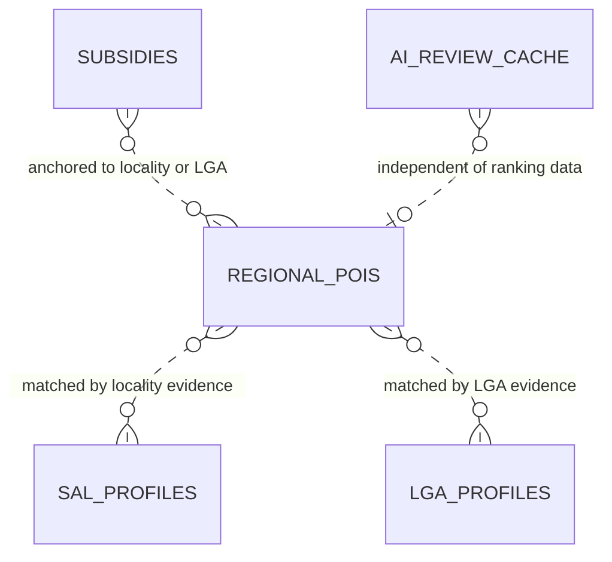
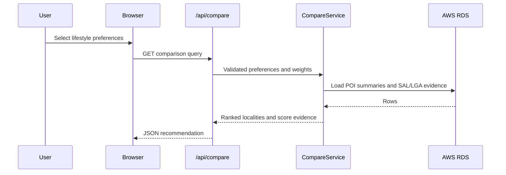
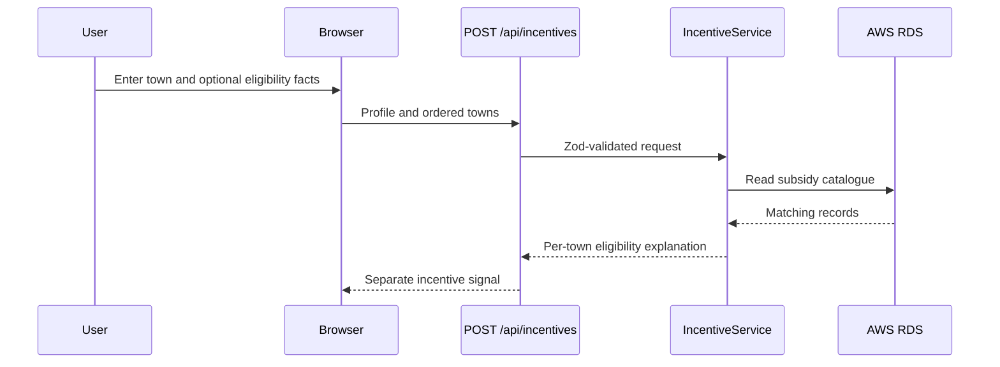

# SERINEA Iteration 2 System Architecture

## Purpose

SERINEA is a Next.js application that recommends regional Victorian localities from user-selected lifestyle needs, then screens separate mock relocation incentives. The application uses AWS RDS as its runtime data source; it does not use a local CSV fallback in production.

## Runtime components

| Component | Responsibility |
| --- | --- |
| Browser UI | Collects preferences, an optional named town, and optional incentive facts such as occupation, age, income, distance and relocation stage. |
| Next.js API routes | Validate HTTP input and delegate business logic. |
| `CompareService` | Scores locality candidates before limiting the result set. |
| `IncentiveService` | Screens incentive eligibility without changing the lifestyle ranking. |
| `AiReviewService` | Optionally checks deterministic preference extraction; it cannot replace it. |
| AWS RDS PostgreSQL | Holds POIs, mock subsidies, SAL profiles, LGA profiles and AI-review cache records. |

## Current RDS data model

The deployed database contains the following application tables:

| Table | Used for |
| --- | --- |
| `public.regional_pois` | Locality POI counts, map points, walking/reach and comparison evidence. |
| `public.subsidies` | Synthetic incentive rules and amounts, keyed by locality/LGA. |
| `public.sal_profiles` | Statistical Area Level profile attributes. |
| `public.lga_profiles` | Local Government Area profile attributes. |
| `public.ai_review_cache` | Best-effort cache for successful optional AI reviews. |

`sal_profiles` and `lga_profiles` are evidence sources, not physical foreign-key parents of `regional_pois`. The backend joins them by locality/LGA names only when it can do so safely; ambiguous SAL names are not guessed.

## Request flows

### Lifestyle recommendation

The composite score is calculated for every eligible locality before sorting and limiting: user needs 75%, POI coverage 15%, and profile evidence 10%. The seven dimensions inside the profile component are handled only in backend code.

### Incentive screening

Incentive results remain separate from the lifestyle score. If a caller supplies towns from comparison, their order is preserved. Occupation is evaluated only when the catalogue record has a real `occupation_restriction`; the current synthetic RDS records use `none` and therefore remain neutral.

